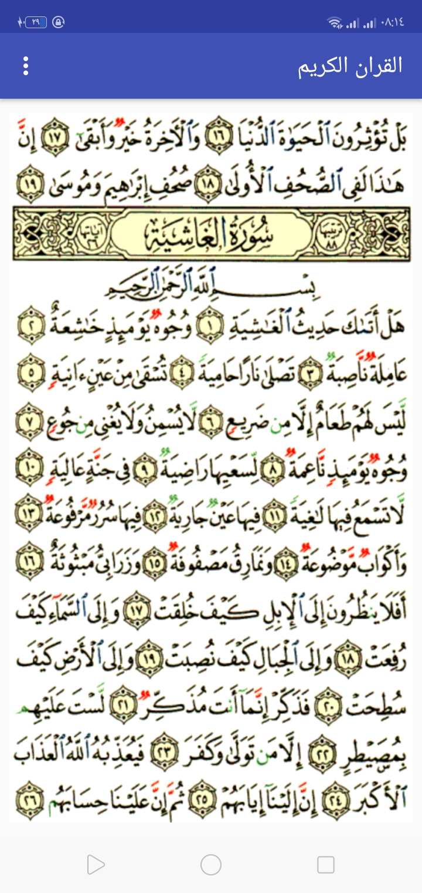
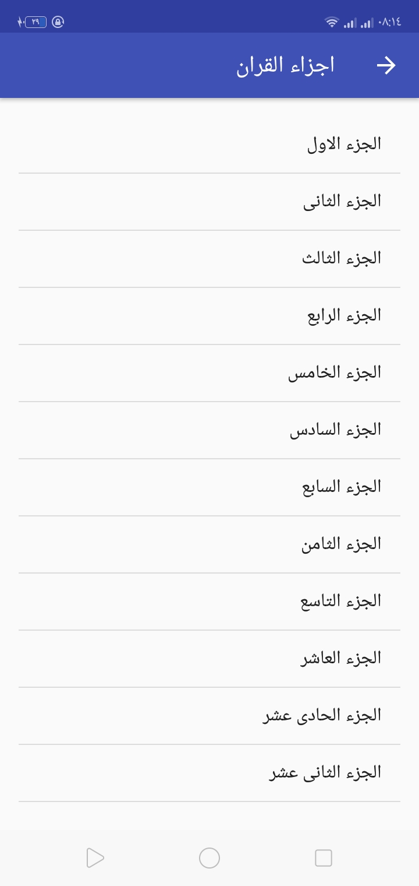
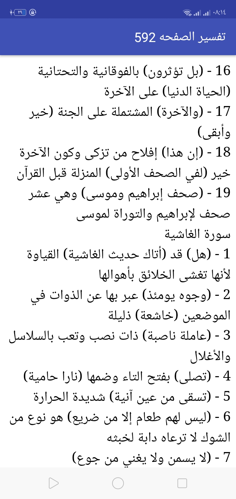
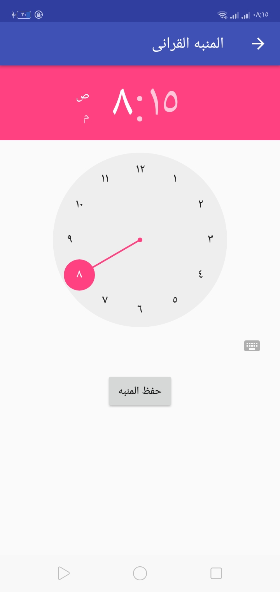

# Quran Kareem Android App

A native Android application built using **Java** that allows users to read and explore the Holy Quran with additional Islamic features such as Tafsir and Quran alarm reminders.

---
## لقطات من التطبيق (Screenshots)

<table style="width:100%">
  <tr>
    <td align="center">
      <br/>
      <b>واجهة المصحف</b>
    </td>
    <td align="center">
      <br/>
      <b>فهرس الأجزاء</b>
    </td>
  </tr>
  <tr>
    <td align="center">
      <br/>
      <b>التفسير</b>
    </td>
    <td align="center">
      <br/>
      <b>منبه الورد القرآني</b>
    </td>
  </tr>
</table>

---

## 📱 Features

- **Quran Browsing**
  - Smooth navigation between Quran pages using `ViewPager`.
  
- **Search Functionality**
  - Search for specific verses or keywords in the Quran.

- **Tafsir (Interpretation)**
  - Access explanations and interpretations for Quran verses.

- **Asbab Al-Nuzul**
  - View the historical context behind Quran revelations.

- **Quran Alarm**
  - Set reminders using `AlarmManager` and `BroadcastReceiver`.

- **Index Navigation**
  - Quickly access Surahs through a structured index.

- **Multiple UI Screens**
  - Clean navigation between screens such as About, Search, Tafsir, and more.

---

## 🛠️ Built With

- **Java**
- **Android SDK**
- **XML Layouts**
- **ViewPager**
- **AlarmManager**
- **BroadcastReceiver**

---

## 🏗️ Architecture

Structured Android activity-based architecture with multiple screens to separate different Quran features.

---

## 📂 Project Structure

- `QouranPager` – Main Quran browsing screen  
- `IndexActivity` – Surah index navigation  
- `Searching` – Quran search functionality  
- `Tafsir` – Quran interpretation screen  
- `AsbabAlnozol` – Revelation context screen  
- `AlarmActivity` – Quran reminder configuration  
- `AlarmReceiver` – Handles alarm triggers  
- `SplashActivity` – App launch screen  

---
## Tech Stack & Requirements:
* **Language:** Java
* **Minimum SDK:** Android 5.0 (API 21)
* **Target SDK:** Android 34
* **Gradle Version:** 8.7
* **Android Gradle Plugin (AGP):** 8.3.0
* **Libraries:** AndroidX, Firebase (Auth & Storage)

---
## 🚀 How to Run

1. Clone the repository:

```bash
git clone https://github.com/Ahmedzagzoug1/quran-kareem.git
